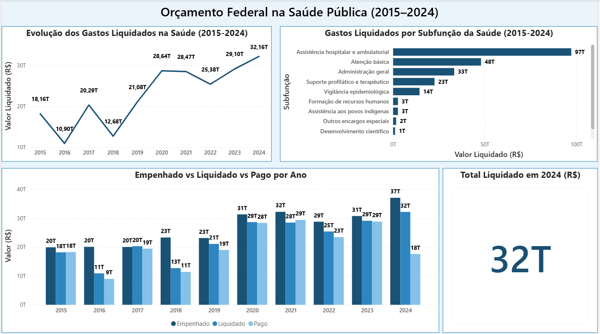

# Orçamento SUS BR

Análise dos gastos federais destinados à função Saúde entre 2015 e 2024, com base nos dados públicos do Portal da Transparência.

## Objetivo

Investigar se o governo federal executa o orçamento planejado para a saúde pública, comparando os valores empenhados, liquidados e pagos ao longo dos anos.

## Principais Perguntas

- O governo gasta o que promete na saúde?
- Os gastos aumentaram ou diminuíram nos últimos 10 anos?
- Quais áreas da saúde recebem mais verba?
- Qual o impacto da pandemia no orçamento da saúde?

## Dashboard

## Conclusões

- **O governo gasta o que promete na saúde?**

    Parcialmente. Em todos os anos analisados, o valor pago foi inferior ao empenhado, indicando que nem todo valor empenhado é pago no mesmo ano. Parte das despesas são pagas via mecanismo de restos a pagar nos anos seguintes.

- **Os gastos aumentaram ou diminuíram nos últimos 10 anos?**

    Aumentaram 77%, saindo de R$18T em 2015 para R$32T em 2024. Porém o crescimento não foi linear, sofreu quedas nos anos de 2016, 2018 e 2022.

- **Quais áreas da saúde recebem mais verba?**

    Assistência hospitalar e ambulatorial lidera com R$97T, seguida pela Atenção básica com R$48T e Administração geral R$33T.

- **Qual o impacto da pandemia no orçamento da saúde?**

    Em 2020, ano em que foi decretada a pandemia no Brasil, os gastos liquidados saíram de R$21T para R$28T, aumento de aproximadamente 36% em um ano. O governo abriu créditos extraordinários para vacinas, leitos de UTI, respiradores, entre outros. Em 2022 com o fim dos gastos pandêmicos, o orçamento recuou para R$25T, queda de 11% em relação a 2020.

## Principais Insights

### Queda em 2018 - Teto de Gastos

A Emenda Constitucional 95, aprovada em 2016, limitou o crescimento dos gastos públicos à inflação do ano anterior, representando uma perda para a saúde no ano de 2018.

### Queda em 2022 - Fim dos Gastos Emergenciais

Com a redução dos gastos pandêmicos, o orçamento recuou para R$25T, queda de 11% em relação a 2020.

### Recorde em 2024 - Flexibilização do Teto de Gastos

A Emenda Constitucional 126, promulgada em 2022, flexibilizou o teto de gastos e permitiu expansão do orçamento da saúde a partir de 2023. Em 2024, os gastos liquidados atingiram R$32T, maior valor da série analisada.

## Pipeline ETL

Os dados foram coletados via API do Portal da Transparência com Python, tratados com Pandas e exportados para CSV como entrada do Power BI.

| Etapa | Detalhe |
|-------|---------|
| **Extract** | Requisições via API do Portal da Transparência ano a ano (2015–2024). Endpoint: `/api-de-dados/despesas/por-funcional-programatica`. Filtro: funcao:10 `(Saúde)`. |
| **Transform** | Conversão dos valores financeiros (empenhado, liquidado, pago) de string (ponto como milhar, vírgula como decimal) para float (retirada do ponto do milhar e alteração da virgula do decimal para ponto). |
| **Load** | Exportação para `data/processed/saude_orcamento.csv`, utilizado como fonte de dados no Power BI Desktop. |

## Fonte dos Dados

- **Portal da Transparência:** api.portaldatransparencia.gov.br
- **Endpoint:** `/api-de-dados/despesas/por-funcional-programatica`
- **Filtro:** Função:10 `(Saúde)`
- **Período:** 2015 a 2024

## Tecnologias

- Python (Pandas, Requests, python-dotenv)
- API Portal da Transparência
- Power BI Desktop
